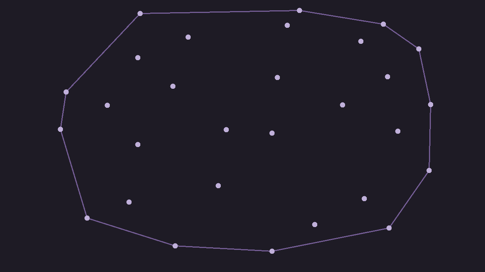

# Computational geometry
Implementation and visualization of 2D computational geometry algorithms along with the necessary data structures.

## Dependencies
- [OCaml](https://ocaml.org/)
- [Dune](https://dune.build/)
- [Graphics](https://ocaml.github.io/graphics/graphics/Graphics/index.html)

## References
- Mark de Berg, Otfried Cheong, Marc van Kreveld, Mark Overmars. *Computational Geometry: Algorithms and Applications*. 3rd Edition, Springer, 2008.

## Algorithms

### Convex hull


Run the following command:

``` bash
dune exec scenes/convex_hull.exe
```
Once the program is running, click on the screen to add points and the hull will be computed dynamically.
