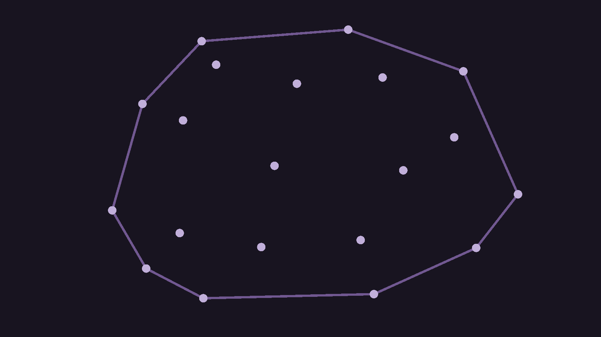

# Computational geometry
Implementation and visualization of common 2D and 3D geometry algorithms with Unity.

These examples have been obtained from the book **"Computational Geometry: Algorithms and applications"**.

## Convex hull

